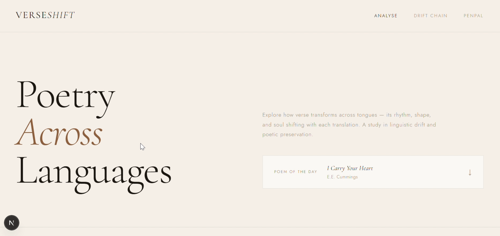
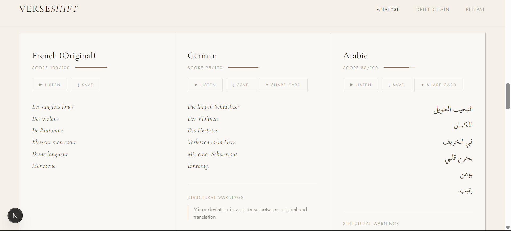
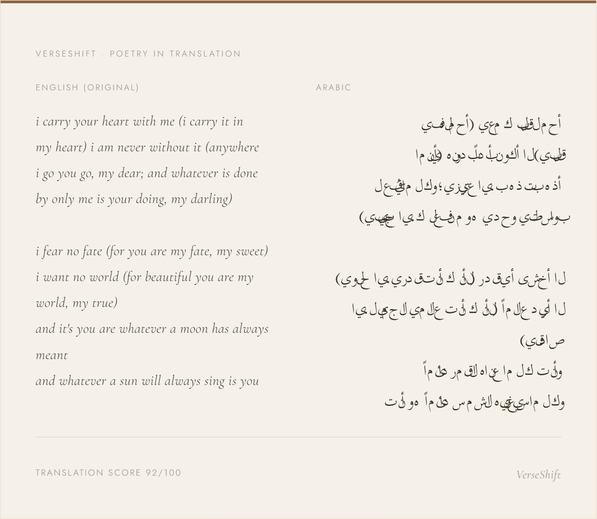

# VerseShift

> What survives when a poem crosses a language?

**VerseShift** is a poetry translation analysis tool that translates your verse and shows you *where* the translation breaks down, where meaning drifts, and where culture gets lost in the crossing.

Built for the **[Lingo.dev Multilingual Hackathon #3](https://lu.ma/lingohackathon3)** · March 2025

## Features

1. Poem of the Day
2. Translation Voice (Brand Voice)
3. Glossary Lock
4. Auto Translate + Analysis (16 Languages)
5. Drift Chain — *The Telephone Game of Poetry*
6. Cultural Idiom Equivalence
7. Audio Playback
8. Download & Export
9. Poetry Penpal Room
---

## Tech Stack

| Layer | Technology |
|---|---|
| **Framework** | [Next.js 14](https://nextjs.org) (App Router) |
| **Translation** | [Lingo.dev SDK](https://lingo.dev) — `lingo.dev/sdk` |
| **AI Analysis** | [Groq](https://groq.com) with `llama-3.1-8b-instant` |
| **Styling** | Vanilla CSS with CSS Variables (no framework) |
| **Typography** | Cormorant Garamond · Jost · Scheherazade New (Google Fonts) |
| **Audio** | Web Speech API (browser-native, zero cost) |
| **Runtime** | Node.js 18+ |

### Lingo.dev Integration

VerseShift uses Lingo.dev in three distinct ways:

1. **`lingo.localizeText()`** — Core translation across all 16 supported locales, used in both the Auto Translate and Drift Chain features
2. **Glossary Lock pattern** — Words wrapped in `«»` markers before being passed to Lingo, preserving untranslatable terms through every hop
3. **Brand Voice injection** — Style persona prompts prepended to poem text before localization, mimicking Lingo.dev's brand voice capability

---

## Project Structure

```
verseshift/
├── app/
│   ├── page.tsx                  # Main UI — all features
│   ├── layout.tsx
│   └── api/
│       ├── translate/
│       │   └── route.ts          # Auto translate + analysis
│       ├── drift/
│       │   └── route.ts          # Drift chain engine
│       ├── idioms/
│       │   └── route.ts          # Cultural idiom equivalence
│       └── rooms/
│           ├── route.ts          # Penpal room create/join/read
│           └── message/
│               └── route.ts      # Send room message
├── lib/
│   ├── aiAnalysis.ts             # Groq analysis (score + warnings)
│   └── roomStore.ts              # In-memory room state
└── .env.local                    # API keys (see setup below)
```

---

## Getting Started

### Prerequisites

- Node.js 18+
- A [Lingo.dev](https://lingo.dev) account with an API key and Engine ID
- A [Groq](https://console.groq.com) API key (free tier works)

### Installation

```bash
# Clone the repo
git clone https://github.com/yourusername/verseshift.git
cd verseshift

# Install dependencies
npm install

# Set up environment variables
cp .env.example .env.local
```

### Environment Variables

Create a `.env.local` file in the root:

```env
LINGODOTDEV_API_KEY=your_lingo_api_key_here
LINGODOTDEV_ENGINE_ID=your_lingo_engine_id_here
GROQ_API_KEY=your_groq_api_key_here
```

### Run Locally

```bash
npm run dev
```

Open [http://localhost:3000](http://localhost:3000)

---

## How to Use

### Basic Translation
1. Select your **source language**
2. Choose a **translation voice** (optional — try *Lyrical* or *Minimalist*)
3. Add any **locked words** that should never be translated
4. Paste your poem (or load the Poem of the Day)
5. Select target languages and click **Analyse Poem**

### Drift Chain
1. Enter a poem in the Analysis section
2. Navigate to **Drift Chain**
3. Build a chain by adding languages in sequence (e.g. FR → JA → AR → EN)
4. Click **Run Drift Chain** to watch your poem evolve

### Poetry Penpal Room
1. Enter your name and preferred reading language
2. Click **Create Room** — share the code or link with a friend
3. Each person writes in their own language — everyone reads in theirs

---

## Supported Languages

| Code | Language | RTL |
|------|----------|-----|
| `en` | English | — |
| `de` | German | — |
| `ar` | Arabic | ✓ |
| `ja` | Japanese | — |
| `fr` | French | — |
| `es` | Spanish | — |
| `hi` | Hindi | — |
| `ur` | Urdu | ✓ |
| `pa` | Punjabi | — |
| `ko` | Korean | — |
| `zh` | Chinese | — |
| `it` | Italian | — |
| `pt` | Portuguese | — |
| `ru` | Russian | — |
| `tr` | Turkish | — |
| `bn` | Bengali | — |

---

## Screenshots

| Feature | Preview |
|---|---|
| Home |  |
| Translation Analysis |  |
| Share Card |  |

## Built With

- [Lingo.dev](https://lingo.dev) — Translation infrastructure
- [Groq](https://groq.com) — Fast LLM inference
- [Next.js](https://nextjs.org) — Framework
- [Google Fonts](https://fonts.google.com) — Cormorant Garamond, Jost, Scheherazade New

---

## License

MIT — see [LICENSE](LICENSE)

---

<div align="center">

*"Poetry is what gets lost in translation." — Robert Frost*


</div>
